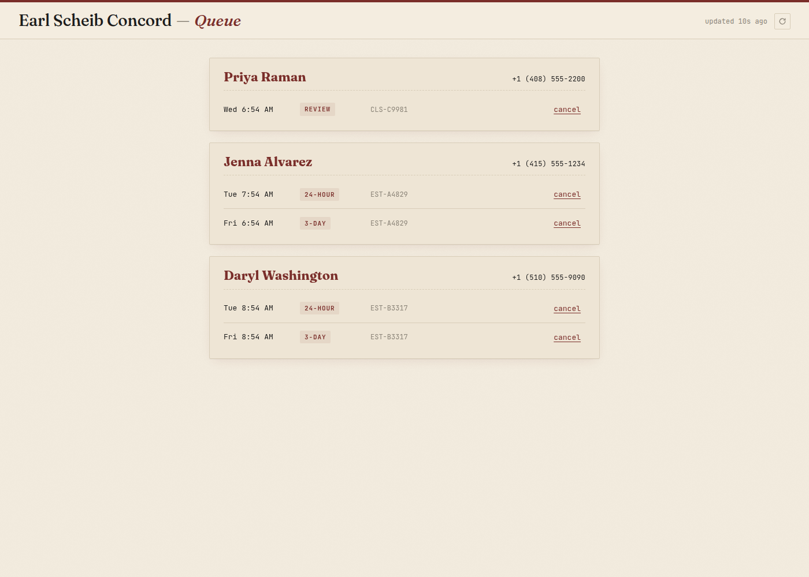
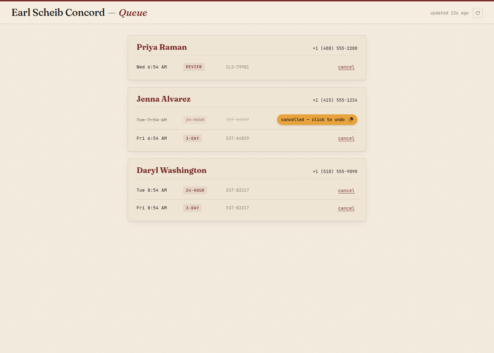
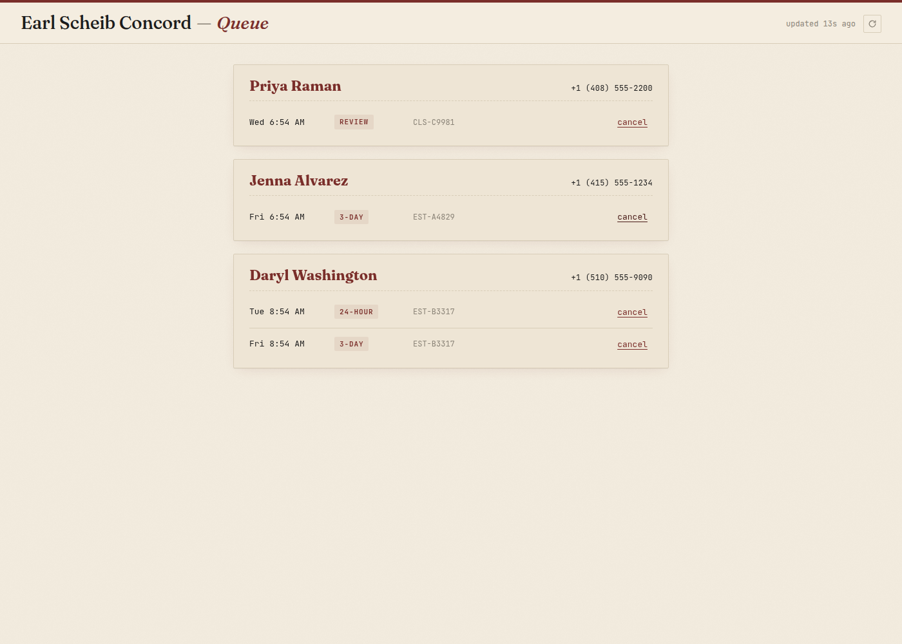
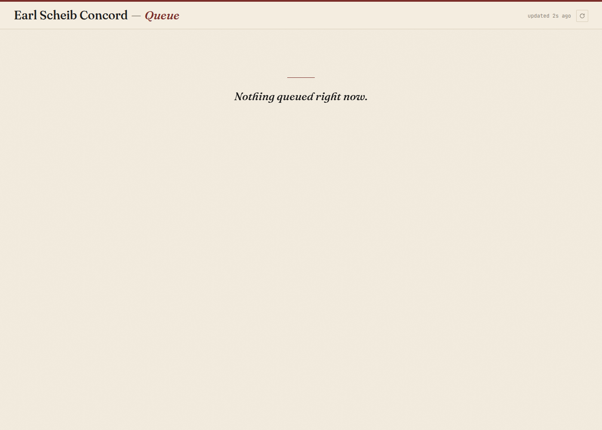

# Earl Scheib EMS Watcher

Sends CCC ONE estimate files to the Earl Scheib follow-up service automatically. Runs every 5 minutes in the background on your shop PC. No setup needed after the first install.

---

## 👋 Marco — start here

### 1. Install (about 2 minutes, one time only)

1. Open this link on your shop PC (the one that runs CCC ONE):

   **https://support.jjagpal.me/earlscheibconcord/download**

2. A file named **`EarlScheibWatcher-Setup.exe`** will download (about 10 MB). It goes to your `Downloads` folder by default.

3. Double-click the file to start the installer.

4. **If you see a blue "Windows protected your PC" screen:** this is normal for new business software. Click **"More info"** (below the main message), then click **"Run anyway"**. The installer will continue.

5. The wizard has three steps:

   | Step | What happens | What you do |
   |---|---|---|
   | **1. Folder** | The installer looks for your CCC ONE export folder. If it finds one, it shows the path. | Confirm the path, or click **Browse** to pick a different one. Click **Next**. |
   | **2. Connection Test** | Checks that your PC can reach the follow-up service over the internet. | Should show a ✓ check. If it fails, check your Wi-Fi; you can also click **Continue anyway**. |
   | **3. CCC ONE Settings** | Shows a reminder to set CCC ONE to save EMS files. | Open CCC ONE on the side, go to **Tools → Extract → EMS Extract Preferences**, check **Lock Estimate** and **Save Workfile**, save. Then check the **"I've done this"** box and click **Finish**. |

6. Done. The watcher now runs every 5 minutes automatically.

7. On the final wizard page there's a checkbox **"Launch Queue Viewer now"** — leave it checked and click **Finish**. Your browser will open to the Queue Admin page (see below) so you can see the system is working.

8. A **"Earl Scheib Queue"** shortcut is added to both your **Desktop** and the **Start Menu** — use it any time to reopen the Queue Admin page.

### 2. What happens after install

- Every 5 minutes, Windows runs the watcher silently in the background. There is no icon, no tray, no popup — it's meant to stay out of your way.
- When CCC ONE exports a new estimate, the watcher picks it up within 5 minutes and sends it to the follow-up service.
- The service schedules text messages to the customer automatically (24-hour follow-up, 3-day follow-up, review request).
- You don't need to do anything else, ever.

### 3. Seeing what's about to go out

The installer puts an **"Earl Scheib Queue"** shortcut on your Desktop and in the Start Menu. Double-click either one, or run this in a Command Prompt:

```
"C:\EarlScheibWatcher\earlscheib.exe" --admin
```

A small black window opens briefly, then your browser auto-opens to the Queue page:



Each pending message shows the **send time** (Pacific), **customer name**, **phone**, **job type** (24-hour / 3-day / review), and the **repair job reference** — grouped by customer.

**To cancel a message:** click the `cancel` link on the row. It strikes through and an amber **"click to undo"** pill appears with a 5-second countdown ring:



If you change your mind, click the pill within 5 seconds and the cancel is aborted. Otherwise the message is permanently removed from the queue:



**When nothing is queued** (overnight, weekends, before the first estimate of the day):



The page **auto-refreshes every 15 seconds**. Press **`R`** (with no text field focused) to refresh manually. Close the browser tab when done — the background window closes itself within 30 seconds.

Full guide: [`docs/admin-ui-guide.md`](docs/admin-ui-guide.md).

### 4. Something's wrong — what do I check?

| Symptom | What to do |
|---|---|
| Customers aren't getting text messages | Open `C:\EarlScheibWatcher\ems_watcher.log` in Notepad. Look for recent errors. If you see "connection failed" repeating, check the shop's internet. |
| Windows SmartScreen blocked the installer | Click **More info → Run anyway**. See step 1.4 above. |
| CCC ONE isn't exporting EMS files | In CCC ONE: **Tools → Extract → EMS Extract Preferences** → make sure both **Lock Estimate** and **Save Workfile** are checked, and the **Output Folder** matches what you entered in the installer. |
| Want to change the CCC ONE folder after install | Open **cmd** as Administrator and run: `C:\EarlScheibWatcher\earlscheib.exe --configure` |
| Want to uninstall | **Settings → Apps**, find **Earl Scheib EMS Watcher**, click **Uninstall**. |
| Something else | Contact **admin@jjagpal.me** |

### 5. Where are things on my PC?

```
C:\EarlScheibWatcher\
  earlscheib.exe        the watcher program
  config.ini            saved folder path + settings
  ems_watcher.log       activity log (safe to read)
  ems_watcher.db        dedup database (don't touch)
```

Windows Task Scheduler (search "Task Scheduler" in the Start menu) shows the watcher listed as **`EarlScheibEMSWatcher`** in the Task Scheduler Library. "Last Run Time" and "Last Run Result" tell you when it last ran.

---

## 🛠 For developers

Everything below is technical. Skip unless you're working on the code.

### What this is

A Windows desktop application for **Earl Scheib Auto Body Concord** that watches the CCC ONE EMS export folder, deduplicates and HMAC-signs BMS XML payloads, POSTs them to a follow-up webhook every 5 minutes via a Windows Scheduled Task, and ships with an on-demand local-browser queue admin UI.

```
┌─────────────────────────────────────────────────────────────────┐
│  MARCO'S PC                           │ support.jjagpal.me (VPS)│
│  (Windows 10 / 11)                    │                         │
│                                       │                         │
│  ┌──────────────────────┐             │  ┌──────────────────┐   │
│  │ earlscheib.exe --scan│─── HMAC ───────▶│  app.py          │   │
│  │ (Scheduled Task,     │    POST BMS │  │  /earlscheibconcord   │
│  │  every 5 min)        │    XML      │  │  → Twilio SMS    │   │
│  └──────────────────────┘             │  │  → jobs.db       │   │
│                                       │  └──────────────────┘   │
│  ┌──────────────────────┐    HMAC GET │         ▲               │
│  │earlscheib.exe --admin│─── /queue ──────────── │               │
│  │(local :random port;  │    HMAC DEL │         │               │
│  │ browser = UI)        │    /queue   │         │               │
│  └──────────────────────┘             │                         │
└─────────────────────────────────────────────────────────────────┘
```

### Status

**v1.0 shipped 2026-04-21** — 5 phases, 19 plans, 41/41 active requirements satisfied. See [`.planning/MILESTONES.md`](.planning/MILESTONES.md) for ship notes and [`.planning/milestones/v1.0-MILESTONE-AUDIT.md`](.planning/milestones/v1.0-MILESTONE-AUDIT.md) for the audit.

### Layout

```
cmd/earlscheib/          Go entrypoint (subcommand dispatcher)
internal/
  admin/                 --admin local HTTP server + browser UI (Phase 5)
  config/                INI parsing + data-dir resolution
  db/                    SQLite dedup + run history (pure-Go driver)
  heartbeat/             /heartbeat POST
  install/               Native install/uninstall/configure (Phase 3)
  logging/               slog + lumberjack rotation
  remoteconfig/          Whitelisted config merge via /remote-config
  scanner/               Settle check + BMS POST loop
  status/                --status output
  telemetry/             Wrap(func) recover → /telemetry
  webhook/               Sign + Send
installer/               Inno Setup .iss + Pascal wizard pages
portable/                Alternative portable-zip distribution
winres/                  Windows resource file + icon
.github/workflows/       CI: cross-compile, sign (conditional), Docker iscc
app.py                   Webhook server — BMS receive, Twilio dispatch,
                         /queue + /telemetry + /remote-config endpoints
tests/                   pytest for /queue endpoint
docs/                    End-user + ops docs
.planning/               GSD planning history (requirements, roadmap, audit)
```

### Tech stack

| Layer | Choice | Why |
|-------|--------|-----|
| Language | Go 1.22+ (client), Python 3 (server) | One static exe on Windows, cross-compiles from Linux, no runtime bundling |
| Build | `go build` + `go-winres` + Inno Setup 6 | Single signed `.exe` for Marco |
| SQLite | `modernc.org/sqlite` (pure Go) | No CGO, no mingw-w64 |
| HTTP | stdlib `net/http` | Zero non-stdlib deps |
| UI | HTML + CSS + vanilla JS (embedded via `go:embed`) | No framework, no bundler, no CDN at runtime |
| Auth | HMAC-SHA256 over raw body, baked-in secret via `-ldflags -X` | Marco cannot accidentally break auth by editing config |
| Scheduling | Windows Scheduled Task every 5 min | Proven model, survives Windows Update |
| Signing | `osslsigncode` (Linux CI) + OV cert | Docker-based, no Windows runner needed |

### Quick start

```bash
# Prereqs on Linux
sudo apt-get install gcc-mingw-w64-x86-64 docker.io
go install github.com/tc-hib/go-winres@v0.3.3

# Build Windows binary (CGO_ENABLED=0, cross-compiled from Linux)
make generate-resources          # generates rsrc_windows_amd64.syso from winres/
make build-windows               # dist/earlscheib-artifact.exe

# Build the installer (Docker + Inno Setup 6.7.1)
docker run --rm -v "$PWD:/work" -w /work amake/innosetup:latest iscc installer/earlscheib.iss
# → installer/Output/EarlScheibWatcher-Setup.exe

# Test
make test                         # go test ./... -race
python3 -m pytest tests/ -q       # server-side /queue endpoint tests

# Locally run the webhook server
python3 app.py                    # listens on :80 (edit PORT env var)

# Locally run the admin UI (on Linux — opens xdg-open instead of rundll32)
CGO_ENABLED=0 go build -o /tmp/esc ./cmd/earlscheib
EARLSCHEIB_DATA_DIR=/tmp/data /tmp/esc --admin
```

### Secret injection

The HMAC secret is baked into the Windows exe at build time. **Never committed**:

```bash
CGO_ENABLED=0 GOOS=windows GOARCH=amd64 \
  go build -ldflags "-X main.secretKey=$GSD_HMAC_SECRET -X main.appVersion=1.0.0 -H windowsgui" \
  -o dist/earlscheib-artifact.exe ./cmd/earlscheib
```

CI reads `GSD_HMAC_SECRET` from GitHub Actions secrets; local dev uses the dev fallback string.

### Subcommands

| Command | Purpose |
|---------|---------|
| `--scan` | Watches the folder, POSTs new BMS XML to the webhook. Runs from Scheduled Task. |
| `--test` | Sends a canned BMS payload to verify connectivity. Exits 0 on 2xx. |
| `--status` | Prints folder reachability, run counts, recent files, recent log errors. |
| `--admin` | Launches local HTTP server + browser for the Queue Admin UI. |
| `--install` | Runs the native install wizard (folder pick, connection test, CCC ONE config). |
| `--uninstall` | Removes Scheduled Task + (optionally) data dir. |
| `--configure` | Re-runs folder selection + connection test without reinstalling. |

### Server side

`app.py` is a single-file stdlib `http.server` on a Linux VM (this box). Routes:

| Route | Method | Auth | Purpose |
|-------|--------|------|---------|
| `/earlscheibconcord` | GET | — | Customer-facing landing page |
| `/earlscheibconcord/download` | GET | — | Download the signed installer exe |
| `/earlscheibconcord/status` | GET | — | Last heartbeat JSON |
| `/earlscheibconcord/heartbeat` | POST | (none, legacy) | Records last-seen timestamp |
| `/earlscheibconcord` | POST | HMAC body | Receives BMS XML, schedules Twilio job |
| `/earlscheibconcord/telemetry` | POST | HMAC body | Client crash report ingest |
| `/earlscheibconcord/remote-config` | GET | HMAC empty body | Returns whitelisted config overrides |
| `/earlscheibconcord/queue` | GET | HMAC empty body | List pending SMS jobs (Phase 5) |
| `/earlscheibconcord/queue` | DELETE | HMAC body | Cancel one pending job by id |

Twilio sends WhatsApp (sandbox) today; switching to production SMS is documented as a one-line change in `app.py`.

### Deploying

This repo is both the client source AND the running production server — `app.py` is served by the `earl-scheib.service` systemd unit on `support.jjagpal.me`. Pulling new changes:

```bash
cd /home/jjagpal/projects/earl-scheib-followup
git pull
# If the installer exe changed, rebuild it:
make build-windows && \
  docker run --rm -v "$PWD:/work" -w /work amake/innosetup:latest iscc installer/earlscheib.iss && \
  cp installer/Output/EarlScheibWatcher-Setup.exe .
# Restart
sudo systemctl restart earl-scheib.service
```

### Planning history

This project was built using [GSD](https://github.com/jjagpal/get-shit-done) (structured planning with planning/research/execution/verification phases). The full artifact trail is in [`.planning/`](.planning/):

- [`PROJECT.md`](.planning/PROJECT.md) — product vision + validated requirements + key decisions
- [`MILESTONES.md`](.planning/MILESTONES.md) — v1.0 ship notes
- [`milestones/v1.0-ROADMAP.md`](.planning/milestones/v1.0-ROADMAP.md) — per-phase details
- [`milestones/v1.0-MILESTONE-AUDIT.md`](.planning/milestones/v1.0-MILESTONE-AUDIT.md) — final audit (tech_debt, user-accepted)
- `milestones/v1.0-phases/` — every `PLAN.md`, `SUMMARY.md`, `VERIFICATION.md` from execution

---

## License & contact

Private / single-customer deployment. Not open for external contribution.

**Support for Marco:** `admin@jjagpal.me` · **Shop support page:** [support.jjagpal.me](https://support.jjagpal.me)
